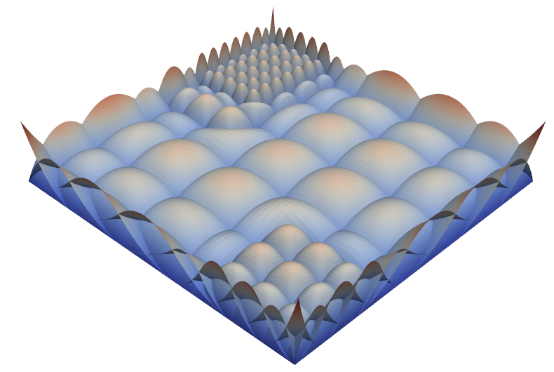

  
  &nbsp;&nbsp;&nbsp;&nbsp;&nbsp;&nbsp;
  

# 👋 Hey there, I'm Christoph!

I'm a mechanical engineer and PhD student at **TUM** and **OTH**.  
My passion lies in computational mechanics, isogeometric analysis (IGA), and numerical methods.  
My mission: solving complex engineering problems with elegance and efficiency.

---

## 🔬 About Me

- 🧠 Researching **CAD-integrated Isogeometric Analysis** with a focus on:
  - Shell structures
  - Trimming
  - THB-splines & LR-splines
  - Adaptive refinement & local mesh refinement
  - Nonlinear explicit dynamics
  - Sheet metal forming
 
  

    
    &nbsp;&nbsp;&nbsp;&nbsp;&nbsp;&nbsp;
    
  

- 💻 Coding in **Python**.

- 🎓 Supervised by:
  - **Prof. Dr.-Ing. habil. Roland Wüchner**  
    Chair of Structural Analysis (Lehrstuhl für Statik und Dynamik), TUM  
    [Visit Chair Website](https://www.cee.ed.tum.de/st/startseite/)
  - **Prof. Dr.-Ing. Marcus Wagner**  
    Labor Finite Elemente Methode, OTH  
    [Visit Laboratory Website](https://maschinenbau.oth-regensburg.de/labore/fem)

---

## 📫 Get in Touch!

- 💼 [LinkedIn](https://www.linkedin.com/in/christoph-hollweck-5962ab231/)
- 📧 Email: hollweck.christoph@gmail.com

