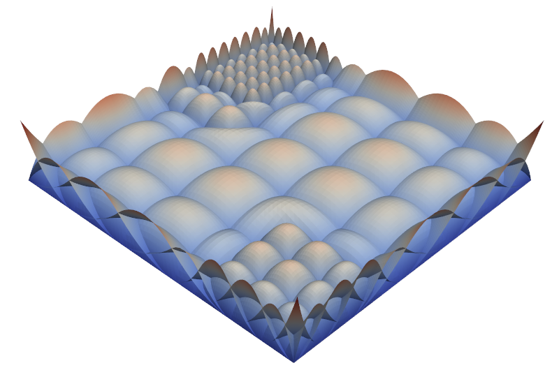
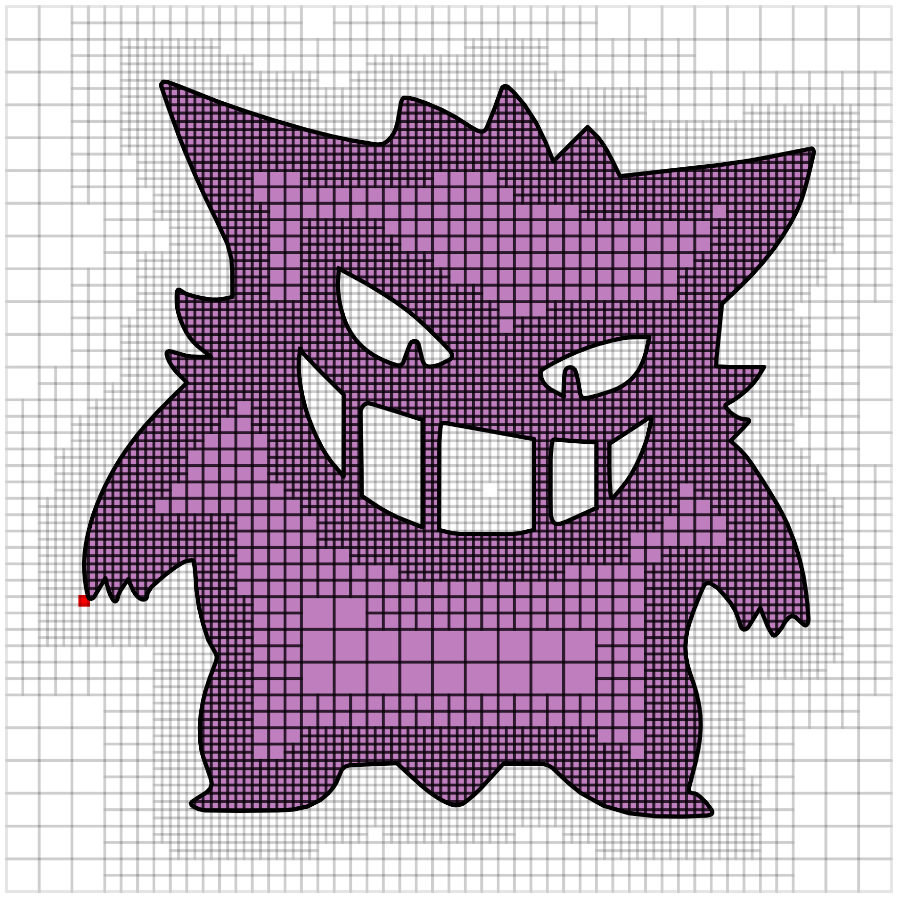

  
  &nbsp;&nbsp;&nbsp;&nbsp;&nbsp;&nbsp;&nbsp;&nbsp;
  

# Christoph Hollweck

PhD candidate in **Computational Mechanics** at the **Technical University of Munich** and research associate at **OTH Regensburg**.

My research focuses on numerical methods for **isogeometric analysis (IGA)** and **nonlinear structural dynamics**, with particular emphasis on CAD-integrated analysis, trimmed geometries, local refinement, and explicit dynamics.

## Research Interests

- Isogeometric analysis
- Finite element methods
- Computational mechanics
- Explicit structural dynamics
- CAD and B-rep geometry processing
- Trimmed and multi-patch spline geometries
- LR-splines and THB-splines
- Local \(h\)-, \(p\)-, and \(k\)-refinement
- Shell formulations
- Critical time-step analysis and mass scaling
- Sheet-metal forming

## IGAEasy

I am the developer of **IGAEasy**, a Python-based research software framework for isogeometric analysis and computational mechanics.

IGAEasy supports my doctoral research in areas including CAD/B-rep and spline geometry processing, local refinement, shell formulations, numerical analysis, scientific visualization, and simulation workflows.

The framework is currently used for ongoing research and is therefore not yet publicly available. **A public release is planned toward the completion of my PhD.**

The visualizations below were generated with **IGAEasy**.

  
  &nbsp;&nbsp;&nbsp;&nbsp;&nbsp;&nbsp;
  

## Selected Publications

### Explicit Dynamics and Trimmed Spline Spaces

**C. Hollweck, L. F. Leidinger, S. Hartmann, M. Wagner, R. Wüchner**  
[**An analysis of the critical time step size for explicit dynamics using trimmed B-splines, LR-splines, and THB-splines**](https://doi.org/10.1016/j.cma.2025.118656)  
*Computer Methods in Applied Mechanics and Engineering*, 450, 118656, 2026.

### Local Refinement and Shifted Boundary Method

**C. Hollweck, A. Gorgi, N. Antonelli, M. Wagner, R. Wüchner**  
[**Local h-, p-, and k-Refinement Strategies for the Isogeometric Shifted Boundary Method Using THB-Splines**](https://arxiv.org/abs/2512.17666)  
arXiv:2512.17666, 2025. Under review at *Computational Mechanics*.

## Current Research Topics

My current work includes:

- Numerical methods for trimmed isogeometric discretizations
- Explicit dynamics with B-splines, LR-splines, and THB-splines
- Critical time-step and spectral analysis
- Local mass scaling for trimming-induced high-frequency outliers
- Local refinement of trimmed shell geometries
- CAD-to-analysis workflows and BEXT-based data exchange
- Industrial applications of isogeometric analysis in LS-DYNA

## Academic Supervision

**Prof. Dr.-Ing. habil. Roland Wüchner**  
Chair of Structural Analysis, Technical University of Munich  
[Chair of Structural Analysis](https://www.cee.ed.tum.de/st/startseite/)

**Prof. Dr.-Ing. Marcus Wagner**  
Finite Element Methods Laboratory, OTH Regensburg  
[Finite Element Methods Laboratory](https://maschinenbau.oth-regensburg.de/labore/fem)
